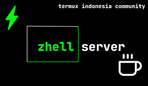

<center><div>

### TERMUX INDONESIA COMMUNITY

<br>


<br>
<article>
php , apache2 and mysql mariadb starter kit for termux android.
</article>

____


</div></center>


```bash
pkg install git -y;
cd $HOME;
git clone https://github.com/Teams-of-Termux-Indonesia/ZhellServer;
cd $HOME/ZhellServer;
chmod 777 install;
./install;
```


____

### Thanks for :

- [RyugenXD](https://github.com/ryugenxd)
- [FianDev](https://github.com/fiandev)
- [Anonymous Contributor](https://github.com/celengbalap)
