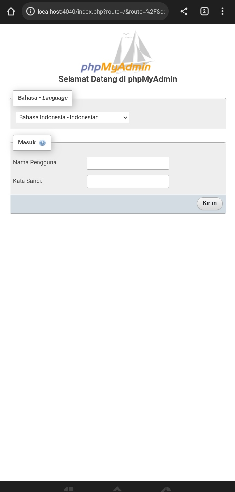
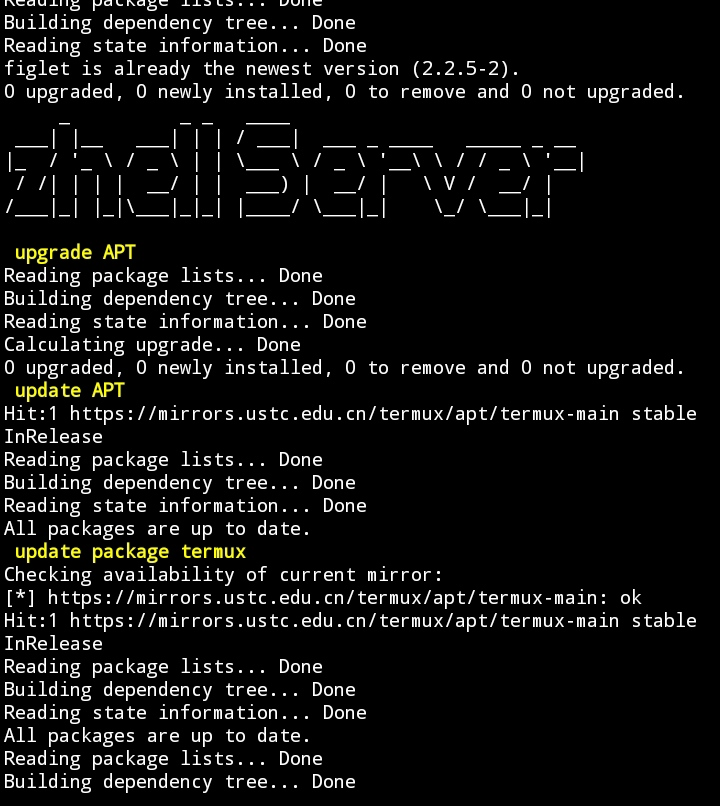
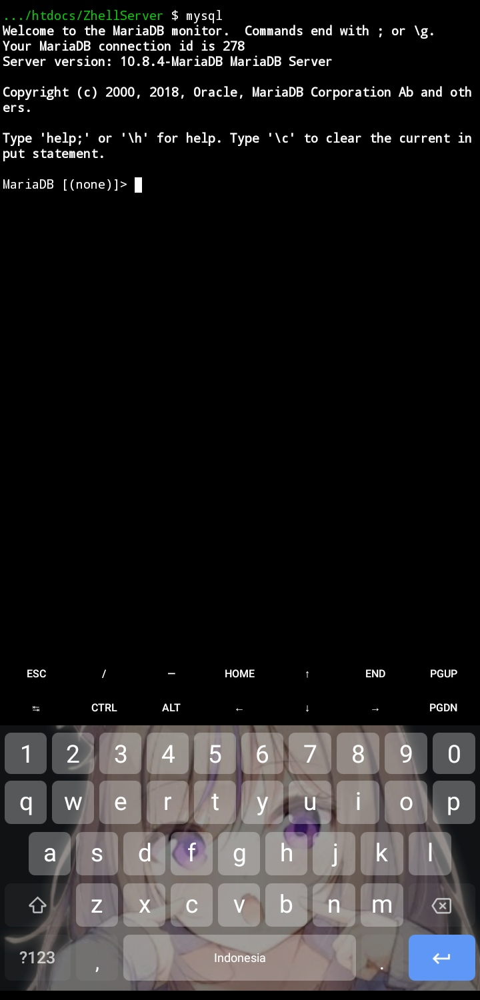

# ZhellServer

Kalau bingung cara instalasi nya silahkan chat sy di WhatsApp
Klik disini
<br> 👇<br>
<a href="https://wa.me/+6281340662711?text=hy 👋 owner gimana cara instalasi zhell server nya">

</a>

### sebuah aplikasi yang dapat mempermudah instalasi server Apache untuk bahasa pemrograman PHP


<hr>

## feature
- SQL DATABASE (mariadb) ✅
- .htaccess support ✅
- webserver apache2 ✅
- using in offline mode ✅
- support mvc and all framework PHP ✅
- support Composer ✅
- PHP CLI ✅
- Support original phpMyAdmin ✅

<hr>

### installation requirement

#### termux (terminal linux)
- Download Termux <a href="https://github.com/termux/termux-app/releases/download/v0.118.0/termux-app_v0.118.0+github-debug_universal.apk">disini</a>

#### text editor
- Download Acode Pro <a href="https://github.com/ryugenxd/ryugenxd/raw/main/programma/com.foxdebug.acode_235.apk">disini</a>

<hr/>

### step installation

```shell
# update && upgrade package
apt update && apt upgrade || pkg update && pkg upgrade
```

```shell
# install git package
pkg install git -y
```

```shell
# clone this project
git clone https://github.com/ryugenxd/ZhellServer && cd ZhellServer
```

```shell
# run this project
chmod 777 install && ./install
```

<hr>


###  Open NEW Session Termux

```
mysqld_safe
```

### Kembali Session 1 

```
mysql;
```

### default MYSQL configuration

```sql
use mysql;
set password for 'root'@'localhost' = password('1234');
flush privileges;
quit;
```

### database configuration
```php
host = 127.0.0.1
username = root
password = 1234
```

### preview

<table border="0">
  <td>
   
  </td>
  <td>
   
  </td>
  <td>
    
  </td>
</table>
