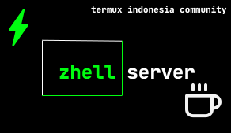

<div align="center">

### TERMUX INDONESIA COMMUNITY



</div>

---
<p>
A PHP, Apache2, and MySQL (MariaDB) starter kit for Termux on Android.
</p>

## Setup
Run the following command in Termux.

### Install curl

```bash
pkg install curl -y
```

### Run setup script via curl

```bash
curl -fsSL https://raw.githubusercontent.com/Teams-of-Termux-Indonesia/ZhellServer/main/setup.sh | bash
```
____

### Thanks for :

- [RyugenXD](https://github.com/ryugenxd)
- [FianDev](https://github.com/fiandev)
- [Anonymous Contributor](https://github.com/celengbalap)
